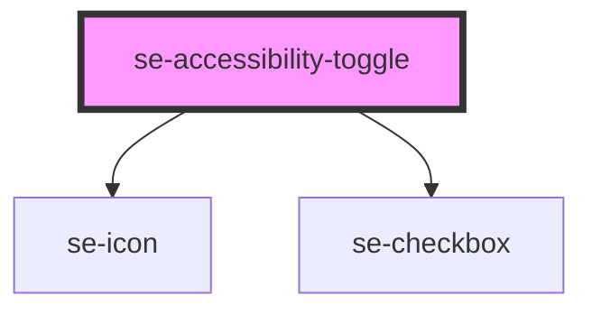

# se-filtration

| Slot   | Description                                                                                       |
| ------ | ------------------------------------------------------------------------------------------------- |
| `selectedItem` | Place the list of item in the header section |
| none | The main content  |

<!-- Auto Generated Below -->

## Properties

| Property       | Attribute        | Description                                          | Type      | Default                    |
| -------------- | ---------------- | ---------------------------------------------------- | --------- | -------------------------- |
| `labelModeOff` | `label-mode-off` | Defines the text when the Accessibility mode is OFF  | `string`  | `'Accessibility mode off'` |
| `labelModeOn`  | `label-mode-on`  | Defines the text when the Accessibility mode is ON   | `string`  | `'Accessibility mode on'`  |
| `selected`     | `selected`       | Defines the state of the toggle. `false` by default. | `boolean` | `false`                    |

## Events

| Event       | Description                                                                               | Type                                  |
| ----------- | ----------------------------------------------------------------------------------------- | ------------------------------------- |
| `didChange` | Passes accessibility toggle state to the parent component on a change of the toggle state | `CustomEvent<{ selected: boolean; }>` |

## Dependencies

### Depends on

- [se-icon](../icon)
- [se-checkbox](../checkbox)

### Graph

----------------------------------------------

*Built with [StencilJS](https://stenciljs.com/)*
