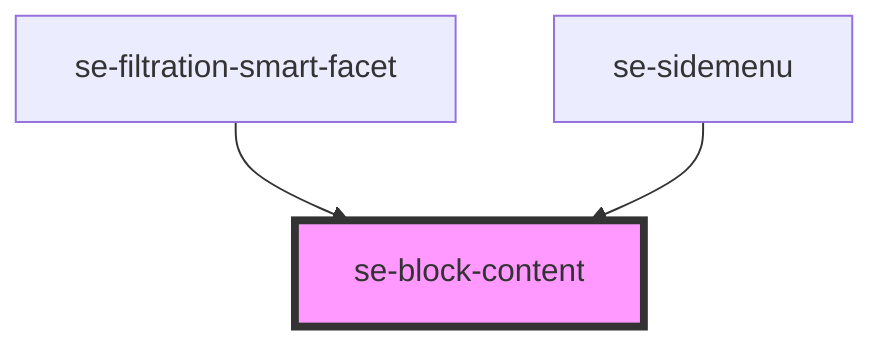

# se-block-content

<!-- Auto Generated Below -->

## Properties

| Property    | Attribute    | Description                                                                                                                                                                                                                              | Type                                      | Default     |
| ----------- | ------------ | ---------------------------------------------------------------------------------------------------------------------------------------------------------------------------------------------------------------------------------------- | ----------------------------------------- | ----------- |
| `maxHeight` | `max-height` | Defines maximum height of the component. If set, scroll will be applied to the block if its height exceeds `maxHeight`. Also, its top and bottom parts will be covered by semi-transparent overlays.                                     | `number \| string`                        | `undefined` |
| `option`    | `option`     | The block-content component will add 8px padding on the top and bottom, and 16px padding on the left and right by default. When the option is set to `fill`, the content will fill the whole space of the block-content with no padding. | `"basic" \| "card" \| "fill" \| "widget"` | `'basic'`   |

## Dependencies

### Used by

 - [se-filtration-smart-facet](../filtration-smart/facet)
 - [se-sidemenu](../sidemenu)

### Graph

----------------------------------------------

*Built with [StencilJS](https://stenciljs.com/)*
