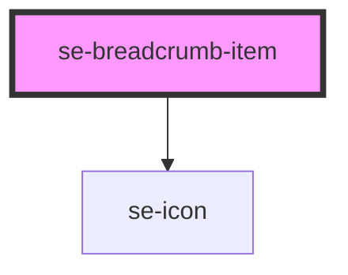

# se-breadcrumb-item

<!-- Auto Generated Below -->

## Properties

| Property        | Attribute        | Description                                                                                                                      | Type      | Default     |
| --------------- | ---------------- | -------------------------------------------------------------------------------------------------------------------------------- | --------- | ----------- |
| `canSelect`     | `can-select`     | Indicates whether or not the breadcrumb item should be selected.  The default setting is `true`.                                 | `boolean` | `true`      |
| `href`          | `href`           | Indicates the URL you wish to navigate to when clicking on your breadcrumb item.                                                 | `string`  | `undefined` |
| `isLast`        | `is-last`        | Indicates whether or not the breadcrumb item should be show a arrow at the end.  The default setting is `false`.                 | `boolean` | `false`     |
| `position`      | `position`       | Indicates the position of an item in a series or sequence of items. Property is used when `withMicrodata` is set to `true` only. | `string`  | `undefined` |
| `withMicrodata` | `with-microdata` | Indicates whether or not microdata attributes are added to markup. The default setting is `false`.                               | `boolean` | `false`     |

## Events

| Event         | Description                                    | Type                             |
| ------------- | ---------------------------------------------- | -------------------------------- |
| `didNavigate` | Event firing when breadcrumbs link is clicked. | `CustomEvent<HTMLAnchorElement>` |

## Dependencies

### Depends on

- [se-icon](../icon)

### Graph

----------------------------------------------

*Built with [StencilJS](https://stenciljs.com/)*
