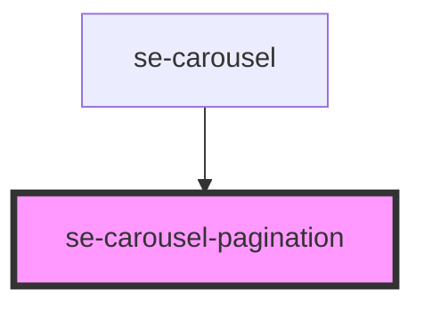

# se-carousel-pagination

<!-- Auto Generated Below -->

## Properties

| Property      | Attribute      | Description                                | Type     | Default     |
| ------------- | -------------- | ------------------------------------------ | -------- | ----------- |
| `activeIndex` | `active-index` | Index of active/selected pagination bullet | `number` | `undefined` |
| `size`        | `size`         | Number of pagination bullets               | `number` | `undefined` |

## Dependencies

### Used by

 - [se-carousel](../carousel)

### Graph

----------------------------------------------

*Built with [StencilJS](https://stenciljs.com/)*
