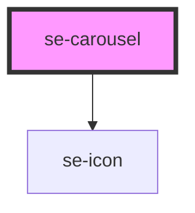

# se-carousel-copy

<!-- Auto Generated Below -->

## Properties

| Property       | Attribute        | Description                                                                           | Type     | Default |
| -------------- | ---------------- | ------------------------------------------------------------------------------------- | -------- | ------- |
| `itemMinWidth` | `item-min-width` | minimum width of the carousel item. The number of item displayed will be based on it. | `number` | `275`   |

## CSS Custom Properties

| Name                       | Description                               |
| -------------------------- | ----------------------------------------- |
| `--se-carousel-item-width` | Default width of se-carousel-item (275px) |

## Dependencies

### Depends on

- [se-icon](../icon)

### Graph

----------------------------------------------

*Built with [StencilJS](https://stenciljs.com/)*
