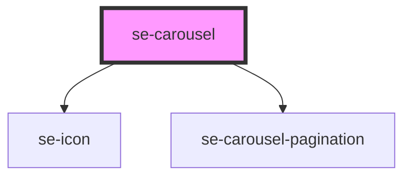

# se-carousel

<!-- Auto Generated Below -->

## Properties

| Property        | Attribute        | Description                                                                                                      | Type      | Default |
| --------------- | ---------------- | ---------------------------------------------------------------------------------------------------------------- | --------- | ------- |
| `arrowsOverlay` | `arrows-overlay` | configures position of arrows. When `arrowsOverlay` is `false` arrows are positioned outside of component bounds | `boolean` | `true`  |
| `hintWidth`     | `hint-width`     | Show a hint of the next item if more item to be seen. if 0, then no hint will be displayed.                      | `number`  | `40`    |
| `itemMinWidth`  | `item-min-width` | minimum width of the carousel item. The number of item displayed will be based on it.                            | `number`  | `275`   |
| `pagination`    | `pagination`     | Configures if pagination dots are shown (https://zeroheight.com/6dbc9efe1/p/045938-pagination/b/934eef)          | `boolean` | `false` |

## Dependencies

### Depends on

- [se-icon](../icon)
- [se-carousel-pagination](../carousel-pagination)

### Graph

----------------------------------------------

*Built with [StencilJS](https://stenciljs.com/)*
