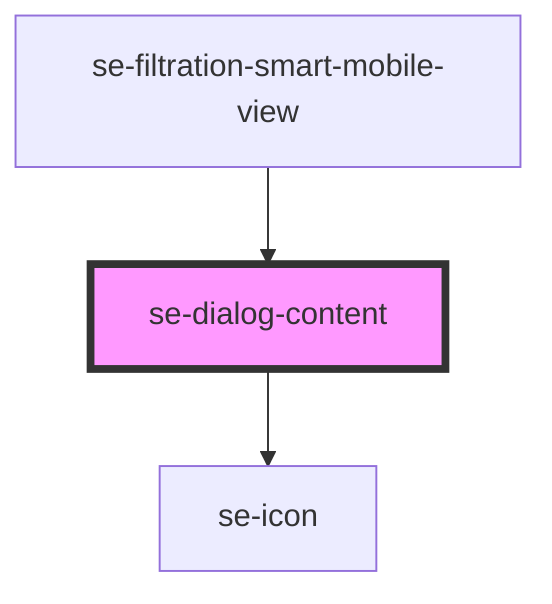

# se-dialog-content

| Slot   | Description                                                                                       |
| ------ | ------------------------------------------------------------------------------------------------- |
| `icon` | Another way to configure your own icon instead of using the icon property (used to load svg icon) |

<!-- Auto Generated Below -->

## Properties

| Property      | Attribute       | Description                                                                                                                                                                                                                                                  | Type                                                                       | Default     |
| ------------- | --------------- | ------------------------------------------------------------------------------------------------------------------------------------------------------------------------------------------------------------------------------------------------------------ | -------------------------------------------------------------------------- | ----------- |
| `icon`        | `icon`          | Indicates an icon you want to display in your dialog.                                                                                                                                                                                                        | `string`                                                                   | `undefined` |
| `iconColor`   | `icon-color`    | Indicates what icon color schema you want to render in your dialog.                                                                                                                                                                                          | `"alternative" \| "information" \| "primary" \| "secondary" \| "standard"` | `undefined` |
| `isLastChild` | `is-last-child` | Indicates if se-dialog-content is the last child of the dialog component.                                                                                                                                                                                    | `boolean`                                                                  | `true`      |
| `option`      | `option`        | **[DEPRECATED]** use padding instead  Defaulted to a small padding. When set to `fill`, the content will fill the whole space of the dialog. When set to `indent`, the content will alternative margins and paddings. | `"fill" \| "indent"`                                                       | `undefined` |
| `padding`     | `padding`       | optional property. define the padding around the button `none` no padding. `small` small padding: default `large` large padding.                                                                                                                             | `"large" \| "none" \| "small"`                                             | `undefined` |

## Dependencies

### Used by

 - [se-filtration-smart-mobile-view](../filtration-smart/mobile-view)

### Depends on

- [se-icon](../icon)

### Graph

----------------------------------------------

*Built with [StencilJS](https://stenciljs.com/)*
