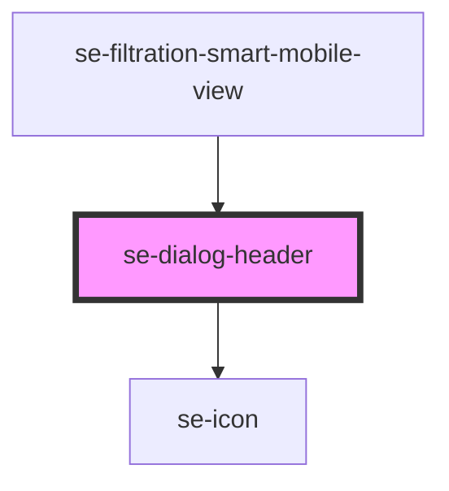

# se-dialog-header

| Slot      | Description                                                                          |
| --------- | ------------------------------------------------------------------------------------ |
| none      | Slot with no name will be used in the main area of the header                        |
| `end`     | Will be display at the end between the title and the close icon                      |

<!-- Auto Generated Below -->

## Properties

| Property    | Attribute    | Description                                                                                                                                                                              | Type                         | Default     |
| ----------- | ------------ | ---------------------------------------------------------------------------------------------------------------------------------------------------------------------------------------- | ---------------------------- | ----------- |
| `closeIcon` | `close-icon` | Display the close icon to close the dialog. Default setting is `false`.                                                                                                                  | `boolean`                    | `false`     |
| `color`     | `color`      | Defines the color of the dialog header. `alternative`: Alternative background with primary color for the text. `primary`: Primary color schema. By default is the parent's dialog color. | `"alternative" \| "primary"` | `undefined` |
| `option`    | `option`     | Defaulted to a small padding. When set to `indent`, the header will have an alternative margins and paddings.                                                                            | `"indent"`                   | `undefined` |

## Events

| Event            | Description                                                                                                                                  | Type               |
| ---------------- | -------------------------------------------------------------------------------------------------------------------------------------------- | ------------------ |
| `didCloseDialog` | Send data to the parent component when clicking an element within the dialog to close it. The modal can then be safely removed from the DOM. | `CustomEvent<any>` |

## Dependencies

### Used by

 - [se-filtration-smart-mobile-view](../filtration-smart/mobile-view)

### Depends on

- [se-icon](../icon)

### Graph

----------------------------------------------

*Built with [StencilJS](https://stenciljs.com/)*
