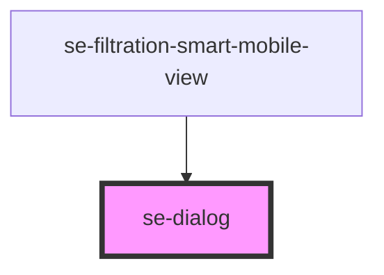

# se-dialog

<!-- Auto Generated Below -->

## Properties

| Property      | Attribute      | Description                                                                                                                                                                                                | Type                                                   | Default     |
| ------------- | -------------- | ---------------------------------------------------------------------------------------------------------------------------------------------------------------------------------------------------------- | ------------------------------------------------------ | ----------- |
| `canBackdrop` | `can-backdrop` | **[DEPRECATED]** use noBackdrop='true' instead  Option to enable clicking on the dialog's backdrop. Will automatically close the modal.  Default setting is `true`. | `boolean`                                              | `true`      |
| `color`       | `color`        | Defines the color of the dialog header. `alternative`: Alternative background with primary color for the text `primary`: Primary color schema and default setting.                                         | `"alternative" \| "primary"`                           | `'primary'` |
| `noBackdrop`  | `no-backdrop`  | Option to enable clicking on the dialog's backdrop. Will automatically close the modal.  Default setting is `false`.                                                                                       | `boolean`                                              | `false`     |
| `open`        | `open`         | Indicates whether or not the dialog is open or closed.  Default setting is `false`.                                                                                                                        | `boolean`                                              | `undefined` |
| `pageScroll`  | `page-scroll`  | Option to scroll page in browser window if set to `true`.                                                                                                                                                  | `boolean`                                              | `undefined` |
| `size`        | `size`         | Defines the size of the modal. `small`: used in alerts and messages `medium`: default setting, used by other apps `fill`: takes the full space of the screen                                               | `"fill" \| "large" \| "medium" \| "small" \| "xlarge"` | `'medium'`  |

## Events

| Event      | Description                                                                                                                                  | Type               |
| ---------- | -------------------------------------------------------------------------------------------------------------------------------------------- | ------------------ |
| `backdrop` | Send data to the parent component when the backdrop is clicked.                                                                              | `CustomEvent<any>` |
| `didClose` | Send data to the parent component when clicking an element within the dialog to close it. The modal can then be safely removed from the DOM. | `CustomEvent<any>` |

## Dependencies

### Used by

 - [se-filtration-smart-mobile-view](../filtration-smart/mobile-view)

### Graph

----------------------------------------------

*Built with [StencilJS](https://stenciljs.com/)*
