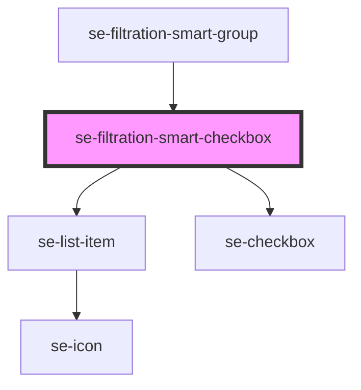

# se-filtration-smart-checkbox

<!-- Auto Generated Below -->

## Properties

| Property                    | Attribute       | Description                                                                       | Type      | Default     |
| --------------------------- | --------------- | --------------------------------------------------------------------------------- | --------- | ----------- |
| `isMobile`                  | `is-mobile`     | Defines if the checkbox is used in mobile view.                                   | `boolean` | `false`     |
| `refinementId` _(required)_ | `refinement-id` | Id of the refinement that will be used to find the data in the Root Filter store. | `string`  | `undefined` |

## Events

| Event                    | Description                                                                                       | Type                  |
| ------------------------ | ------------------------------------------------------------------------------------------------- | --------------------- |
| `refinementStateChanged` | Event that has info about refinement whose state should be changed. Root component listens to it. | `CustomEvent<string>` |

## Dependencies

### Used by

 - [se-filtration-smart-group](../group)

### Depends on

- [se-list-item](../../list-item)
- [se-checkbox](../../checkbox)

### Graph

----------------------------------------------

*Built with [StencilJS](https://stenciljs.com/)*
