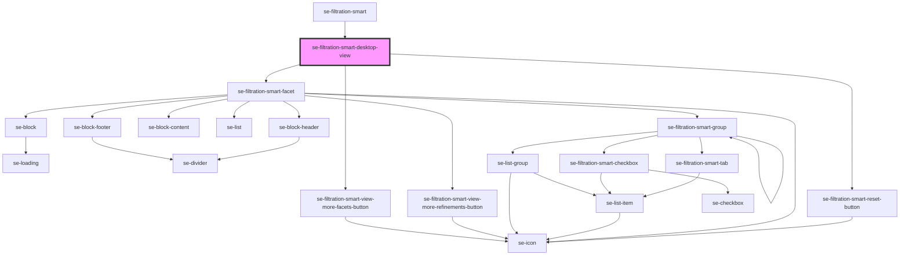

# se-filtration-smart-desktop-view

<!-- Auto Generated Below -->

## Properties

| Property                                | Attribute                     | Description                                                                | Type     | Default     |
| --------------------------------------- | ----------------------------- | -------------------------------------------------------------------------- | -------- | ----------- |
| `headerLabel`                           | `header-label`                | Defines text that will be used as the header of the Filter.                | `string` | `undefined` |
| `maxFacetContentHeight`                 | `max-facet-content-height`    | Defines maximum height of a section content.                               | `number` | `undefined` |
| `resetButtonLabel` _(required)_         | `reset-button-label`          | Defines text that will be used in the "Reset" button.                      | `string` | `undefined` |
| `viewLessFacetsLabel` _(required)_      | `view-less-facets-label`      | Defines text of the "View less facets" button at the bottom of the filter. | `string` | `undefined` |
| `viewLessRefinementsLabel` _(required)_ | `view-less-refinements-label` | Defines text of the "View less refinements" button in a facet.             | `string` | `undefined` |
| `viewMoreFacetsLabel` _(required)_      | `view-more-facets-label`      | Defines text of the "View more facets" button at the bottom of the filter. | `string` | `undefined` |
| `viewMoreRefinementsLabel` _(required)_ | `view-more-refinements-label` | Defines text of the "View more refinements" button in a facet.             | `string` | `undefined` |

## Dependencies

### Used by

 - [se-filtration-smart](..)

### Depends on

- [se-filtration-smart-reset-button](../reset-button)
- [se-filtration-smart-facet](../facet)
- [se-filtration-smart-view-more-facets-button](../view-more-facets-button)

### Graph

----------------------------------------------

*Built with [StencilJS](https://stenciljs.com/)*
