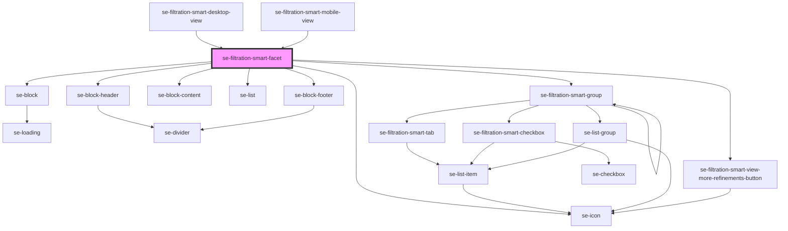

# se-filtration-smart-facet

<!-- Auto Generated Below -->

## Properties

| Property               | Attribute            | Description                                             | Type      | Default     |
| ---------------------- | -------------------- | ------------------------------------------------------- | --------- | ----------- |
| `facetId` _(required)_ | `facet-id`           | Facet ID that will be used to retrieve data from store. | `string`  | `undefined` |
| `isMobile`             | `is-mobile`          | Defines if the facet is used in mobile view.            | `boolean` | `false`     |
| `maxContentHeight`     | `max-content-height` | Defines maximum height of the content.                  | `number`  | `undefined` |
| `viewLessLabel`        | `view-less-label`    | Defines text of the "View less refinements" button.     | `string`  | `undefined` |
| `viewMoreLabel`        | `view-more-label`    | Defines text of the "View more refinements" button.     | `string`  | `undefined` |

## Events

| Event                     | Description                                                                                                             | Type                  |
| ------------------------- | ----------------------------------------------------------------------------------------------------------------------- | --------------------- |
| `toggleIsSectionExpanded` | Event that has info about facet whose collapsed/expanded state should be changed.  Root Filter component listens to it. | `CustomEvent<string>` |

## Dependencies

### Used by

 - [se-filtration-smart-desktop-view](../desktop-view)
 - [se-filtration-smart-mobile-view](../mobile-view)

### Depends on

- [se-block](../../block)
- [se-block-header](../../block-header)
- [se-icon](../../icon)
- [se-block-content](../../block-content)
- [se-list](../../list)
- [se-filtration-smart-group](../group)
- [se-block-footer](../../block-footer)
- [se-filtration-smart-view-more-refinements-button](../view-more-refinements-button)

### Graph

----------------------------------------------

*Built with [StencilJS](https://stenciljs.com/)*
