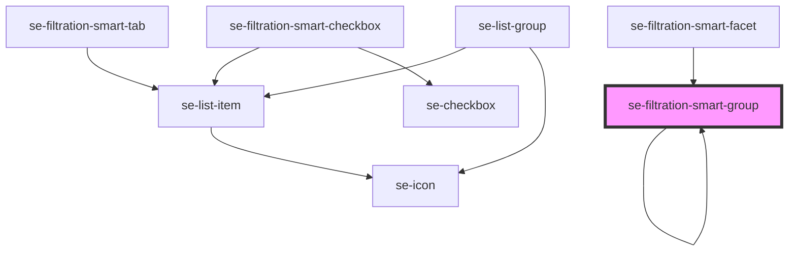

# se-filtration-smart-group

<!-- Auto Generated Below -->

## Properties

| Property                 | Attribute    | Description                                                                                        | Type      | Default     |
| ------------------------ | ------------ | -------------------------------------------------------------------------------------------------- | --------- | ----------- |
| `isMobile`               | `is-mobile`  | Set mobile view or not                                                                             | `boolean` | `false`     |
| `level`                  | `level`      | Nesting level of the group. Used to determine if the section should be wrapped in another section. | `number`  | `0`         |
| `sectionId` _(required)_ | `section-id` | Id of the section that will be used to find the data in the Root Filter store.                     | `string`  | `undefined` |

## Events

| Event                     | Description                                                                                                                   | Type                  |
| ------------------------- | ----------------------------------------------------------------------------------------------------------------------------- | --------------------- |
| `toggleIsSectionExpanded` | Event that has info about the section whose collapsed/expanded state should be changed.  Root Filter component listens to it. | `CustomEvent<string>` |

## Dependencies

### Used by

 - [se-filtration-smart-facet](../facet)
 - [se-filtration-smart-group](.)

### Depends on

- [se-filtration-smart-tab](../tab)
- [se-filtration-smart-checkbox](../checkbox)
- [se-filtration-smart-group](.)
- [se-list-group](../../list-group)

### Graph

----------------------------------------------

*Built with [StencilJS](https://stenciljs.com/)*
