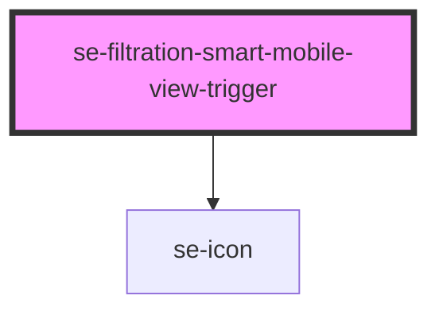

# se-filtration-smart-mobile-view-trigger

<!-- Auto Generated Below -->

## Properties

| Property             | Attribute | Description                                                   | Type     | Default     |
| -------------------- | --------- | ------------------------------------------------------------- | -------- | ----------- |
| `count`              | `count`   | The number of facets in which there are selected refinements. | `number` | `undefined` |
| `label` _(required)_ | `label`   | The text label of the "Show filter" button.                   | `string` | `undefined` |

## Events

| Event              | Description                                      | Type                |
| ------------------ | ------------------------------------------------ | ------------------- |
| `toggleMobileView` | Event that toggle visibility of the mobile view. | `CustomEvent<void>` |

## Dependencies

### Depends on

- [se-icon](../../icon)

### Graph

----------------------------------------------

*Built with [StencilJS](https://stenciljs.com/)*
