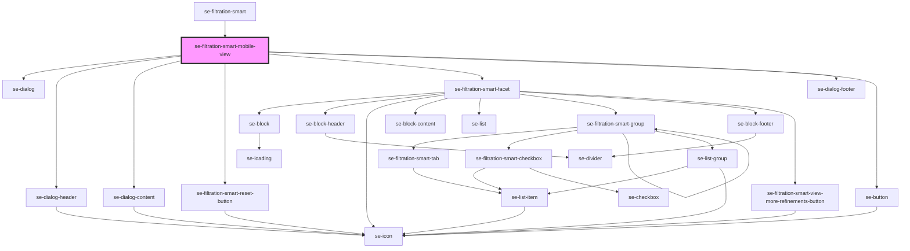

# se-filtration-smart-mobile-view

<!-- Auto Generated Below -->

## Properties

| Property                         | Attribute             | Description                                           | Type      | Default     |
| -------------------------------- | --------------------- | ----------------------------------------------------- | --------- | ----------- |
| `headerLabel`                    | `header-label`        | The header label of filters.                          | `string`  | `undefined` |
| `isVisible` _(required)_         | `is-visible`          | Defines if the mobile view is visible.                | `boolean` | `undefined` |
| `resetButtonLabel` _(required)_  | `reset-button-label`  | Defines text that will be used in the "Reset" button. | `string`  | `undefined` |
| `showProductsLabel` _(required)_ | `show-products-label` | The text label of the show products button.           | `string`  | `undefined` |

## Events

| Event              | Description                                                                                                                                                                                                       | Type                                      |
| ------------------ | ----------------------------------------------------------------------------------------------------------------------------------------------------------------------------------------------------------------- | ----------------------------------------- |
| `toggleMobileView` | Event that closes mobile view with two options:  { restore: true } -- closes mobile view and undoes changes made in mobile view  { restore: false } -- closes mobile view and applies changes made in mobile view | `CustomEvent<ToggleMobileViewVisibility>` |

## Dependencies

### Used by

 - [se-filtration-smart](..)

### Depends on

- [se-dialog](../../dialog)
- [se-dialog-header](../../dialog-header)
- [se-dialog-content](../../dialog-content)
- [se-filtration-smart-reset-button](../reset-button)
- [se-filtration-smart-facet](../facet)
- [se-dialog-footer](../../dialog-footer)
- [se-button](../../button)

### Graph

----------------------------------------------

*Built with [StencilJS](https://stenciljs.com/)*
