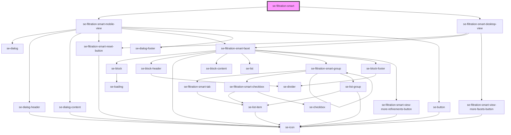

# se-filtration-smart-mobile

<!-- Auto Generated Below -->

## Properties

| Property                                | Attribute                             | Description                                                                | Type                  | Default     |
| --------------------------------------- | ------------------------------------- | -------------------------------------------------------------------------- | --------------------- | ----------- |
| `filters` _(required)_                  | --                                    | Normalized data for the filter.                                            | `FiltrationSmartData` | `undefined` |
| `headerLabelDesktop`                    | `header-label-desktop`                | The header label of filters used in desktop version.                       | `string`              | `undefined` |
| `headerLabelMobile`                     | `header-label-mobile`                 | The header label of filters used in mobile version.                        | `string`              | `undefined` |
| `isMobileViewVisible`                   | `is-mobile-view-visible`              | Defines if the mobile view is visible.                                     | `boolean`             | `false`     |
| `maxFacetContentHeight`                 | `max-facet-content-height`            | Defines maximum height of a facet content in desktop view.                 | `number`              | `undefined` |
| `resetButtonLabel` _(required)_         | `reset-button-label`                  | Defines text that will be used in the "Reset" button.                      | `string`              | `undefined` |
| `showProductsLabel` _(required)_        | `show-products-label`                 | Defines text of the show products button (in mobile view).                 | `string`              | `undefined` |
| `viewLessFacetsLabel` _(required)_      | `view-less-facets-label`              | Defines text of the "View less facets" button at the bottom of the filter. | `string`              | `undefined` |
| `viewLessRefinementsLabel` _(required)_ | `view-less-refinements-label`         | Defines text of the "View less refinements" button in a facet.             | `string`              | `undefined` |
| `viewMoreFacetsLabel` _(required)_      | `view-more-facets-label`              | Defines text of the "View more facets" button at the bottom of the filter. | `string`              | `undefined` |
| `viewMoreRefinementsLabel` _(required)_ | `view-more-refinements-label`         | Defines text of the "View more refinements" button in a facet.             | `string`              | `undefined` |
| `visibleFacetsCount`                    | `visible-facets-count`                | Number of facets to show on initial render.                                | `number`              | `undefined` |
| `visibleRefinementsPerFacetCount`       | `visible-refinements-per-facet-count` | Number of refinements per facet to show on initial render.                 | `number`              | `undefined` |

## Events

| Event                | Description                               | Type                              |
| -------------------- | ----------------------------------------- | --------------------------------- |
| `filterStateChanged` | Event that emits list of checked filters. | `CustomEvent<FilterEmittedState>` |

## Methods

### `reset() => Promise<void>`

Use it if you want to reset the filter to its initial state.
All controls (single- and multi-selects) will be set to its initial states
(if on an initial render a checkbox was checked but later was unchecked by a user, it will be returned to checked state).
All sections (root and nested) will retain their states (expanded/collapsed).

#### Returns

Type: `Promise<void>`

### `setIsFilterChecked(filterId: string, isChecked: boolean) => Promise<void>`

Use it if you want to set the state (checked/unchecked) of a particular filter.

#### Returns

Type: `Promise<void>`

## Dependencies

### Depends on

- [se-filtration-smart-mobile-view](mobile-view)
- [se-filtration-smart-desktop-view](desktop-view)

### Graph

----------------------------------------------

*Built with [StencilJS](https://stenciljs.com/)*
