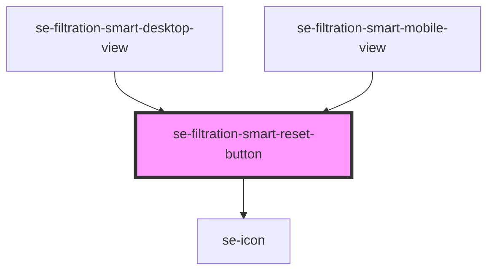

# se-filtration-smart-reset-button

<!-- Auto Generated Below -->

## Properties

| Property             | Attribute  | Description                               | Type      | Default     |
| -------------------- | ---------- | ----------------------------------------- | --------- | ----------- |
| `disabled`           | `disabled` | Defines if the button should be disabled. | `boolean` | `false`     |
| `label` _(required)_ | `label`    | Text label of the button.                 | `string`  | `undefined` |

## Events

| Event             | Description                                     | Type                |
| ----------------- | ----------------------------------------------- | ------------------- |
| `resetAllClicked` | Event that reset Smart Filter to initial state. | `CustomEvent<void>` |

## Dependencies

### Used by

 - [se-filtration-smart-desktop-view](../desktop-view)
 - [se-filtration-smart-mobile-view](../mobile-view)

### Depends on

- [se-icon](../../icon)

### Graph

----------------------------------------------

*Built with [StencilJS](https://stenciljs.com/)*
