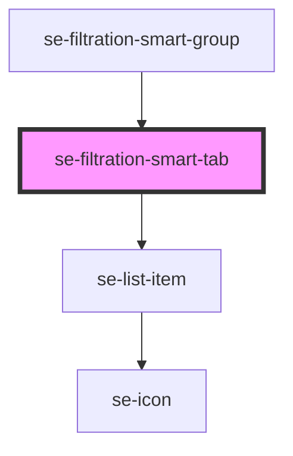

# se-filtration-smart-tab

<!-- Auto Generated Below -->

## Properties

| Property                    | Attribute       | Description                                                                   | Type     | Default     |
| --------------------------- | --------------- | ----------------------------------------------------------------------------- | -------- | ----------- |
| `refinementId` _(required)_ | `refinement-id` | Id of the filter that will be used to find the data in the Root Filter store. | `string` | `undefined` |

## Events

| Event                    | Description                                                                                       | Type                  |
| ------------------------ | ------------------------------------------------------------------------------------------------- | --------------------- |
| `refinementStateChanged` | Event that has info about tab whose state should be changed. Root Filter component listens to it. | `CustomEvent<string>` |

## Dependencies

### Used by

 - [se-filtration-smart-group](../group)

### Depends on

- [se-list-item](../../list-item)

### Graph

----------------------------------------------

*Built with [StencilJS](https://stenciljs.com/)*
