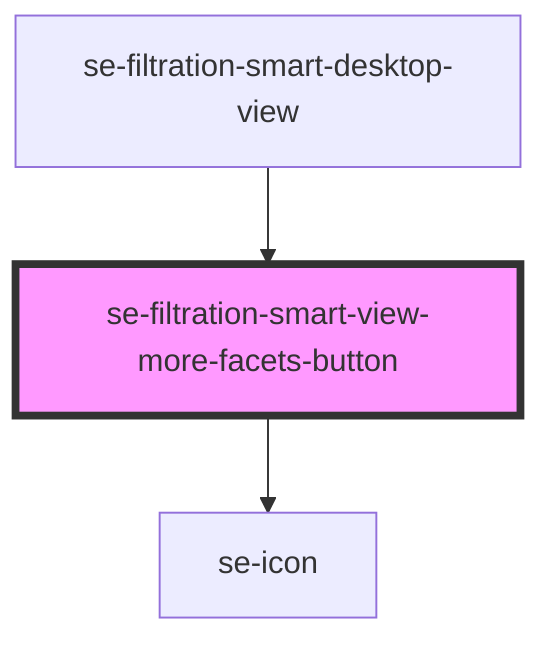

# se-filtration-smart-view-more-facets-button

<!-- Auto Generated Below -->

## Properties

| Property                          | Attribute               | Description                                                                                     | Type      | Default     |
| --------------------------------- | ----------------------- | ----------------------------------------------------------------------------------------------- | --------- | ----------- |
| `count` _(required)_              | `count`                 | Defines what number should be rendered in the circle inside the button.                         | `number`  | `undefined` |
| `isAllFacetsVisible` _(required)_ | `is-all-facets-visible` | Defines what label should be used inside the button:  true => "show less"  false => "show more" | `boolean` | `undefined` |
| `viewLessLabel` _(required)_      | `view-less-label`       | Defines text of the "View less" button.                                                         | `string`  | `undefined` |
| `viewMoreLabel` _(required)_      | `view-more-label`       | Defines text of the "View more" button.                                                         | `string`  | `undefined` |

## Events

| Event                  | Description                                                             | Type                |
| ---------------------- | ----------------------------------------------------------------------- | ------------------- |
| `toggleViewMoreFacets` | Event that signals Smart Filter to toggle visibility of all its facets. | `CustomEvent<void>` |

## Dependencies

### Used by

 - [se-filtration-smart-desktop-view](../desktop-view)

### Depends on

- [se-icon](../../icon)

### Graph

----------------------------------------------

*Built with [StencilJS](https://stenciljs.com/)*
