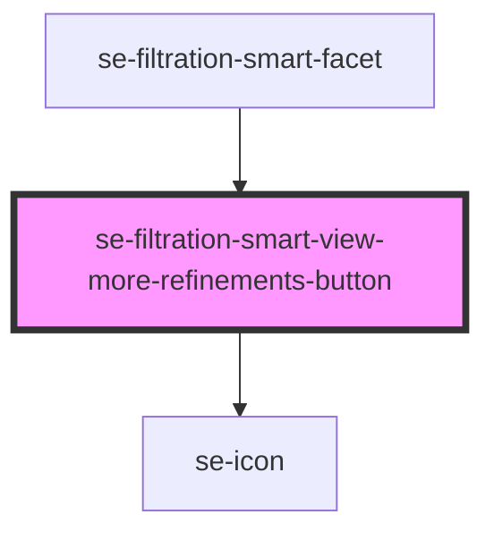

# se-filtration-smart-view-more-refinements-button

<!-- Auto Generated Below -->

## Properties

| Property                  | Attribute                    | Description                                                                                     | Type      | Default     |
| ------------------------- | ---------------------------- | ----------------------------------------------------------------------------------------------- | --------- | ----------- |
| `count`                   | `count`                      | Defines what number should be rendered in the circle inside the button.                         | `number`  | `undefined` |
| `facetId` _(required)_    | `facet-id`                   |                                                                                                 | `string`  | `undefined` |
| `isAllRefinementsVisible` | `is-all-refinements-visible` | Defines what label should be used inside the button:  true => "show less"  false => "show more" | `boolean` | `undefined` |
| `viewLessLabel`           | `view-less-label`            | Defines text of the "View less" button.                                                         | `string`  | `undefined` |
| `viewMoreLabel`           | `view-more-label`            | Defines text of the "View more" button.                                                         | `string`  | `undefined` |

## Events

| Event                       | Description                                                                  | Type                  |
| --------------------------- | ---------------------------------------------------------------------------- | --------------------- |
| `toggleViewMoreRefinements` | Event that signals Smart Filter to toggle visibility of all its refinements. | `CustomEvent<string>` |

## Dependencies

### Used by

 - [se-filtration-smart-facet](../facet)

### Depends on

- [se-icon](../../icon)

### Graph

----------------------------------------------

*Built with [StencilJS](https://stenciljs.com/)*
