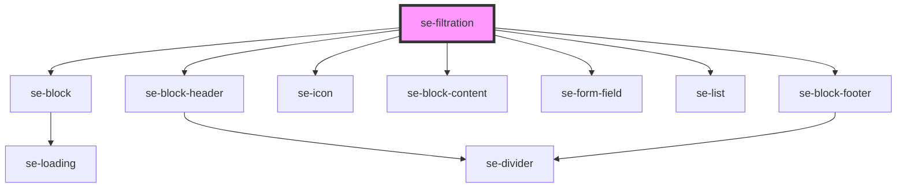

# se-filtration

<!-- Auto Generated Below -->

## Properties

| Property        | Attribute         | Description                                                                                                                                           | Type      | Default        |
| --------------- | ----------------- | ----------------------------------------------------------------------------------------------------------------------------------------------------- | --------- | -------------- |
| `collapsed`     | `collapsed`       | Boolean property to indicate if the content will be visible or hidden collapsed = `true` => content is shown collapsed = `false` => content is hidden | `boolean` | `true`         |
| `labelHint`     | `label-hint`      | Text for the placeholder. the default is `enter text`                                                                                                 | `string`  | `'enter text'` |
| `labelSelect`   | `label-select`    | text to display in the header                                                                                                                         | `string`  | `'Select'`     |
| `labelViewLess` | `label-view-less` | Default text to display for viewing less content                                                                                                      | `string`  | `'View Less'`  |
| `labelViewMore` | `label-view-more` | Default value to display for viewing more content                                                                                                     | `string`  | `'View More'`  |
| `maxItems`      | `max-items`       | Maximum number of items to be displayed when expanded. Default is `20`                                                                                | `number`  | `20`           |
| `minItems`      | `min-items`       | Minimum number of items to be displayed when collapsed. Default is `5`                                                                                | `number`  | `5`            |
| `selectAll`     | `select-all`      | Optional property to indicate if multiple selections will be made `true` = multiple selection \| `false` = single selection                           | `boolean` | `false`        |
| `shadow`        | `shadow`          | Boolean property to indicate if there should be a shadow around the box valid values are `true` or `false`                                            | `boolean` | `false`        |

## Events

| Event          | Description                                       | Type               |
| -------------- | ------------------------------------------------- | ------------------ |
| `didSearch`    | Event emitter for callback with the searched text | `CustomEvent<any>` |
| `didSelectAll` | Event emitter for callback to select all items    | `CustomEvent<any>` |

## Dependencies

### Depends on

- [se-block](../block)
- [se-block-header](../block-header)
- [se-icon](../icon)
- [se-block-content](../block-content)
- [se-form-field](../form-field)
- [se-list](../list)
- [se-block-footer](../block-footer)

### Graph

----------------------------------------------

*Built with [StencilJS](https://stenciljs.com/)*
