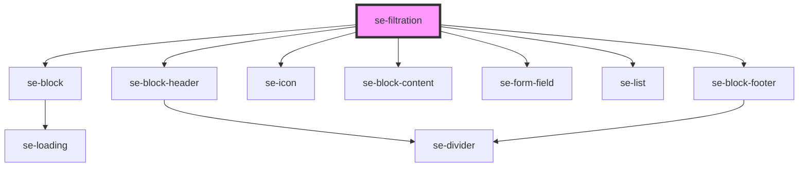

# se-filtration

<!-- Auto Generated Below -->

## Properties

| Property        | Attribute         | Description | Type      | Default        |
| --------------- | ----------------- | ----------- | --------- | -------------- |
| `collapsed`     | `collapsed`       |             | `boolean` | `true`         |
| `labelHint`     | `label-hint`      |             | `string`  | `'enter text'` |
| `labelSelect`   | `label-select`    |             | `string`  | `'Select'`     |
| `labelViewMore` | `label-view-more` |             | `string`  | `'View more'`  |
| `searchText`    | `search-text`     |             | `string`  | `''`           |
| `searchable`    | `searchable`      |             | `boolean` | `false`        |
| `shadow`        | `shadow`          |             | `boolean` | `false`        |

## Events

| Event       | Description | Type               |
| ----------- | ----------- | ------------------ |
| `didSearch` |             | `CustomEvent<any>` |

## Dependencies

### Depends on

- [se-block](../block)
- [se-block-header](../block-header)
- [se-icon](../icon)
- [se-block-content](../block-content)
- [se-form-field](../form-field)
- [se-list](../list)
- [se-block-footer](../block-footer)

### Graph

----------------------------------------------

*Built with [StencilJS](https://stenciljs.com/)*
