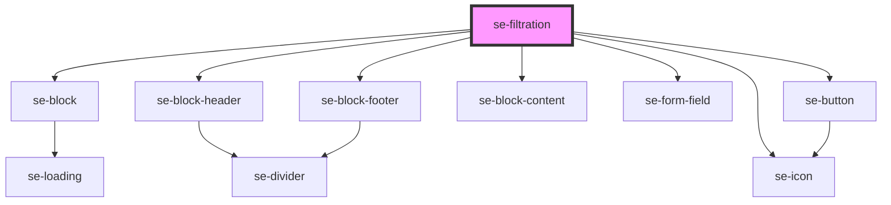

# se-filtration

<!-- Auto Generated Below -->

## Properties

| Property    | Attribute   | Description | Type      | Default    |
| ----------- | ----------- | ----------- | --------- | ---------- |
| `collapsed` | `collapsed` |             | `boolean` | `false`    |
| `label`     | `label`     |             | `string`  | `'Select'` |

## Events

| Event         | Description | Type               |
| ------------- | ----------- | ------------------ |
| `didSearch`   |             | `CustomEvent<any>` |
| `didViewMore` |             | `CustomEvent<any>` |

## Dependencies

### Depends on

- [se-block](../block)
- [se-block-header](../block-header)
- [se-button](../button)
- [se-block-content](../block-content)
- [se-form-field](../form-field)
- [se-icon](../icon)
- [se-block-footer](../block-footer)

### Graph

----------------------------------------------

*Built with [StencilJS](https://stenciljs.com/)*
