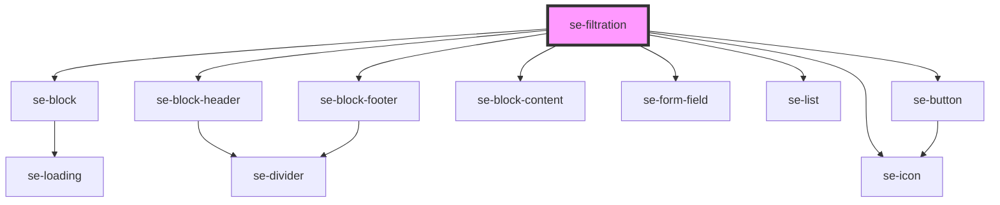

# se-filtration

<!-- Auto Generated Below -->

## Properties

| Property    | Attribute   | Description | Type      | Default        |
| ----------- | ----------- | ----------- | --------- | -------------- |
| `collapsed` | `collapsed` | `true` or `false` | `boolean` | `true`         |
| `hint`      | `hint`      | text for placeholder | `string`  | `'enter text'` |
| `label`     | `label`     | text for the component | `string`  | `'Select'`     |
| `shadow`    | `shadow`    | `true` if want a shadow; `false` otherwise | `boolean` | `false`        |

## Events

| Event       | Description | Type               |
| ----------- | ----------- | ------------------ |
| `didSearch` | Callback | `CustomEvent<any>` |

## Dependencies

### Depends on

- [se-block](../block)
- [se-block-header](../block-header)
- [se-button](../button)
- [se-block-content](../block-content)
- [se-form-field](../form-field)
- [se-icon](../icon)
- [se-list](../list)
- [se-block-footer](../block-footer)

### Graph

----------------------------------------------

*Built with [StencilJS](https://stenciljs.com/)*
