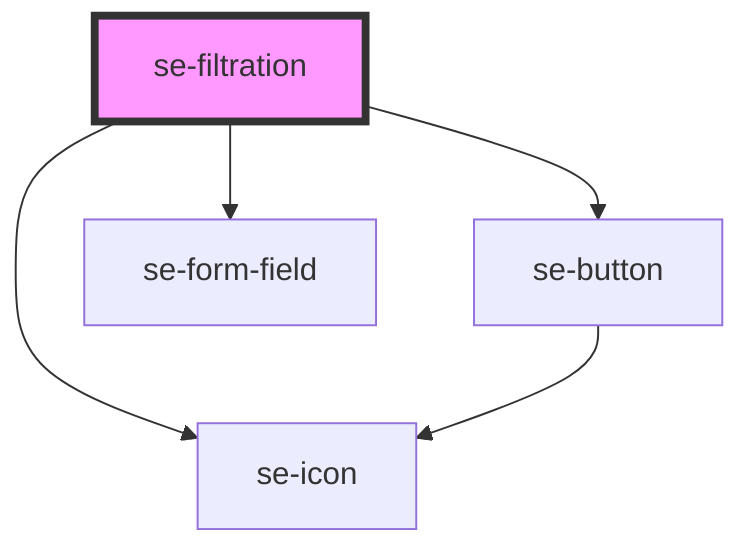

# se-filtration

<!-- Auto Generated Below -->

## Properties

| Property     | Attribute    | Description                  | Type      | Default    |
| ------------ | ------------ | ---------------------------- | --------- | ---------- |
| `label`      | `label`      | Label for the filtration box | `string`  | `'Select'` |
| `moreItems`  | `more-items` | Number of more items that will be displayed in the footer if `scrollable` is set to `true` | `number`  | `0`        |
| `scrollable` | `scrollable` | Optional value to set the list to be scrollable | `boolean` | `false`    |
| `searchable` | `searchable` | Optional if the filtration box needs to have search box | `boolean` | `false`    |

## Events

| Event         | Description | Type               |
| ------------- | ----------- | ------------------ |
| `didSearch`   | Optional callback event that is fired if the user enters text to search | `CustomEvent<any>` |
| `didViewMore` |  Optional callback event that is fired if the user clicks the `View More|Less` link | `CustomEvent<any>` |

## Dependencies

### Depends on

- [se-button](../button)
- [se-form-field](../form-field)
- [se-icon](../icon)

### Graph

----------------------------------------------

*Built with [StencilJS](https://stenciljs.com/)*
