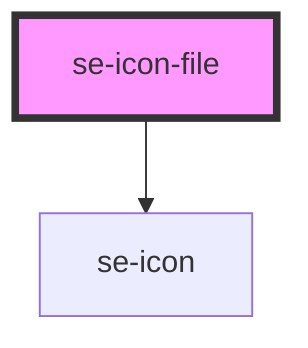

# se-icon-file

<!-- Auto Generated Below -->

## Properties

| Property   | Attribute  | Description                                                                                                                                                                                               | Type                                                                                                            | Default     |
| ---------- | ---------- | --------------------------------------------------------------------------------------------------------------------------------------------------------------------------------------------------------- | --------------------------------------------------------------------------------------------------------------- | ----------- |
| `color`    | `color`    | Optional property that defines the background color of the button. The default color will be inherited from its parent.                                                                                   | `"alternative" \| "error" \| "information" \| "primary" \| "secondary" \| "standard" \| "success" \| "warning"` | `undefined` |
| `disabled` | `disabled` | Optional property that defines if the button is disabled.  Set to `false` by default.                                                                                                                     | `boolean`                                                                                                       | `false`     |
| `option`   | `option`   | Optional property to define if the icon should act as a button (clickable).                                                                                                                               | `"button"`                                                                                                      | `undefined` |
| `size`     | `size`     | Defines the size of an icon. `nano` sets the size to 14px. `small` sets the size to 24px.(default setting) `medium` sets the size to 32px. `large` sets the size to 52px. `xlarge` sets the size to 62px. | `"large" \| "medium" \| "nano" \| "small" \| "xlarge"`                                                          | `undefined` |
| `value`    | `value`    | Text displayed inside the SVG icon. The text cannot be longer than 4 character.                                                                                                                           | `string`                                                                                                        | `undefined` |

## Dependencies

### Depends on

- [se-icon](../icon)

### Graph

----------------------------------------------

*Built with [StencilJS](https://stenciljs.com/)*
