# se-icon

| Slot | Description                                                |
| ---- | ---------------------------------------------------------- |
| none | used to load svg icon instead of using the icon string tag |

<!-- Auto Generated Below -->

## Properties

| Property     | Attribute     | Description                                                                                                                                                                                                                              | Type                                                                                                            | Default     |
| ------------ | ------------- | ---------------------------------------------------------------------------------------------------------------------------------------------------------------------------------------------------------------------------------------- | --------------------------------------------------------------------------------------------------------------- | ----------- |
| `animation`  | `animation`   | Optional property that defines if the icon should animate when changing states (rotation for example).                                                                                                                                   | `boolean`                                                                                                       | `false`     |
| `color`      | `color`       | Optional property that defines the background color of the button. The default color will be inherited from its parent.                                                                                                                  | `"alternative" \| "error" \| "information" \| "primary" \| "secondary" \| "standard" \| "success" \| "warning"` | `undefined` |
| `disabled`   | `disabled`    | Optional property that defines if the button is disabled.  Set to `false` by default.                                                                                                                                                    | `boolean`                                                                                                       | `false`     |
| `hoverColor` | `hover-color` | Optional property that defines the hover background color of the button. This property is ignored if noHover is set, or if the icon option is not set to "button".                                                                       | `"alternative" \| "primary" \| "secondary" \| "standard"`                                                       | `undefined` |
| `mirror`     | `mirror`      | Optional property that defines if the icon should be mirrored.                                                                                                                                                                           | `"both" \| "horizontal" \| "vertical"`                                                                          | `undefined` |
| `noHover`    | `no-hover`    | Optional property that disables the hover background (only if option property is set to button). If set, this will override the hoverColor property and ignore it.                                                                       | `boolean`                                                                                                       | `false`     |
| `option`     | `option`      | Optional property to define if the icon should act as a button (clickable).                                                                                                                                                              | `"button"`                                                                                                      | `undefined` |
| `rotate`     | `rotate`      | Optional property that defines the icon should be rotated.                                                                                                                                                                               | `number \| string`                                                                                              | `0`         |
| `size`       | `size`        | Defines the size of an icon. `nano` sets the size to 14px. `micro` sets the size to 18px. `small` sets the size to 24px.(default setting) `medium` sets the size to 32px. `large` sets the size to 52px. `xlarge` sets the size to 62px. | `"large" \| "medium" \| "micro" \| "nano" \| "small" \| "xlarge"`                                               | `undefined` |

## Dependencies

### Used by

 - [se-banner](../banner)
 - [se-breadcrumb-item](../breadcrumb-item)
 - [se-button](../button)
 - [se-carousel](../carousel)
 - [se-chip](../chip)
 - [se-dialog-content](../dialog-content)
 - [se-dialog-header](../dialog-header)
 - [se-fab](../fab)
 - [se-fab-item](../fab-item)
 - [se-filtration](../filtration)
 - [se-filtration-smart-facet](../filtration-smart/facet)
 - [se-filtration-smart-mobile-view-trigger](../filtration-smart/mobile-view-trigger)
 - [se-filtration-smart-reset-button](../filtration-smart/reset-button)
 - [se-filtration-smart-view-more-facets-button](../filtration-smart/view-more-facets-button)
 - [se-filtration-smart-view-more-refinements-button](../filtration-smart/view-more-refinements-button)
 - [se-header](../header)
 - [se-icon-file](../icon-file)
 - [se-list-group](../list-group)
 - [se-list-item](../list-item)
 - [se-pagination](../pagination)
 - [se-sidemenu](../sidemenu)
 - [se-snackbar](../snackbar)
 - [se-stepper](../stepper)
 - [se-tabbar](../tabbar)
 - [se-table-item-header](../table-item-header)
 - [se-tooltip-content](../tooltip-content)
 - [se-tooltip-header](../tooltip-header)

### Graph

```mermaid
graph TD;
  se-banner --> se-icon
  se-breadcrumb-item --> se-icon
  se-button --> se-icon
  se-carousel --> se-icon
  se-chip --> se-icon
  se-dialog-content --> se-icon
  se-dialog-header --> se-icon
  se-fab --> se-icon
  se-fab-item --> se-icon
  se-filtration --> se-icon
  se-filtration-smart-facet --> se-icon
  se-filtration-smart-mobile-view-trigger --> se-icon
  se-filtration-smart-reset-button --> se-icon
  se-filtration-smart-view-more-facets-button --> se-icon
  se-filtration-smart-view-more-refinements-button --> se-icon
  se-header --> se-icon
  se-icon-file --> se-icon
  se-list-group --> se-icon
  se-list-item --> se-icon
  se-pagination --> se-icon
  se-sidemenu --> se-icon
  se-snackbar --> se-icon
  se-stepper --> se-icon
  se-tabbar --> se-icon
  se-table-item-header --> se-icon
  se-tooltip-content --> se-icon
  se-tooltip-header --> se-icon
  style se-icon fill:#f9f,stroke:#333,stroke-width:4px
```

----------------------------------------------

*Built with [StencilJS](https://stenciljs.com/)*
