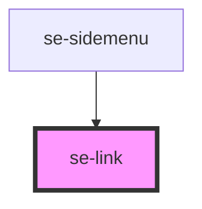

# se-link

<!-- Auto Generated Below -->

## Properties

| Property   | Attribute  | Description                                                                                                                                                                                                                                                               | Type                       | Default      |
| ---------- | ---------- | ------------------------------------------------------------------------------------------------------------------------------------------------------------------------------------------------------------------------------------------------------------------------- | -------------------------- | ------------ |
| `disabled` | `disabled` | Determines whether or not the link is disabled.                                                                                                                                                                                                                           | `boolean`                  | `undefined`  |
| `download` | `download` | Determines whether it's a download link or a url.                                                                                                                                                                                                                         | `boolean`                  | `undefined`  |
| `option`   | `option`   | Adds visual and function properties to your link component. The default setting is `internal`, which redirects you to the specified URL in the same page. The `external` setting adds an underline and ">" icon to the link, and opens the link in a new web browser tab. | `"external" \| "internal"` | `'internal'` |
| `spacing`  | `spacing`  | Defines the spacing around the link. `none` is 0px `small` is 4px                                                                                                                                                                                                         | `"none" \| "small"`        | `'small'`    |
| `unicolor` | `unicolor` | Sets :hover and :visited states the same color as main                                                                                                                                                                                                                    | `boolean`                  | `false`      |
| `url`      | `url`      | Defines the url the user should get redirected to when clicking on the link.                                                                                                                                                                                              | `string`                   | `undefined`  |

## Dependencies

### Used by

 - [se-sidemenu](../sidemenu)

### Graph

----------------------------------------------

*Built with [StencilJS](https://stenciljs.com/)*
