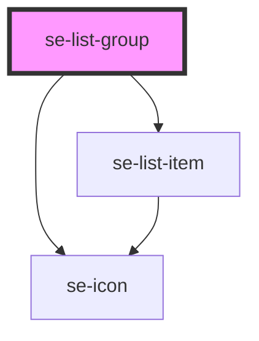

# se-list-group

| Slot   | Description                                                                                       |
| ------ | ------------------------------------------------------------------------------------------------- |
| `start` | Place the element in from of the icon |
| `icon` | Another way to configure your own icon instead of using the icon property (used to load svg icon) |
| `item` | Another way to configure the item text |
| `description` | Another way to configure the description text |
| `end` | Place the element after the item and description  |
| none | The list that goes inside the group item  |

<!-- Auto Generated Below -->

## Properties

| Property      | Attribute      | Description                                                                                                          | Type                       | Default     |
| ------------- | -------------- | -------------------------------------------------------------------------------------------------------------------- | -------------------------- | ----------- |
| `canCollapse` | `can-collapse` | Defines if list groups can be collapsed, true by default.                                                            | `boolean`                  | `true`      |
| `collapsed`   | `collapsed`    | Defines if the item group is collapsed/closed. The default setting is `false`.                                       | `boolean`                  | `false`     |
| `description` | `description`  | Defines the description of the item, placed under its title.                                                         | `string`                   | `undefined` |
| `disabled`    | `disabled`     | Disable the item for any interaction.                                                                                | `boolean`                  | `undefined` |
| `flex`        | `flex`         | define the flex behavior of the group                                                                                | `number`                   | `undefined` |
| `icon`        | `icon`         | Places an icon on the left side of the item list.                                                                    | `string`                   | `undefined` |
| `iconColor`   | `icon-color`   | Optional property to define the color of the icon. The default color will be inherited from it's parent.             | `"primary" \| "secondary"` | `undefined` |
| `indentation` | `indentation`  | Defines the group indentation to add paddings to the list item (used with multiple list groups).                     | `number`                   | `1`         |
| `item`        | `item`         | Defines the title of the item.                                                                                       | `string`                   | `undefined` |
| `selected`    | `selected`     | Defines if the list group should be displayed as selected (if one of its child elements is selected when collapsed). | `boolean`                  | `undefined` |

## Events

| Event              | Description                                           | Type                              |
| ------------------ | ----------------------------------------------------- | --------------------------------- |
| `didGroupClick`    | Emitted when the group item is clicked.               | `CustomEvent<boolean>`            |
| `didGroupCollapse` | Emitted when the group item is collapsed/uncollapsed. | `CustomEvent<GroupCollapseEvent>` |

## Methods

### `focusElement() => Promise<void>`

#### Returns

Type: `Promise<void>`

### `setOption(option: any) => Promise<void>`

#### Returns

Type: `Promise<void>`

### `toggleCollapseTreeview() => Promise<void>`

#### Returns

Type: `Promise<void>`

## Dependencies

### Depends on

- [se-list-item](../list-item)
- [se-icon](../icon)

### Graph

----------------------------------------------

*Built with [StencilJS](https://stenciljs.com/)*
