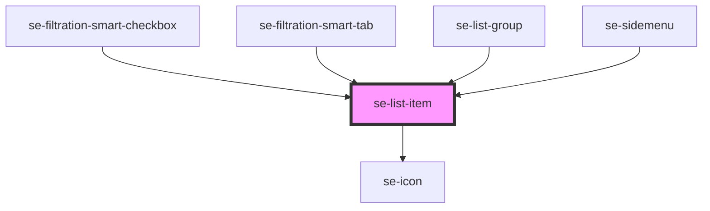

# se-list-item

| Slot   | Description                                                                                       |
| ------ | ------------------------------------------------------------------------------------------------- |
| `start` | Place the element in from of the icon |
| `icon` | Another way to configure your own icon instead of using the icon property (used to load svg icon) |
| `item` | Another way to configure the item text |
| `description` | Another way to configure the description text |
| `end` | Place the element after the item and description  |
| none | same as `slot=end`  |

<!-- Auto Generated Below -->

## Properties

| Property      | Attribute     | Description                                                                                                                   | Type                                                                                           | Default     |
| ------------- | ------------- | ----------------------------------------------------------------------------------------------------------------------------- | ---------------------------------------------------------------------------------------------- | ----------- |
| `description` | `description` | Defines the description of the item, placed under its title.                                                                  | `string`                                                                                       | `undefined` |
| `disabled`    | `disabled`    | Disable the item for any interaction.                                                                                         | `boolean`                                                                                      | `undefined` |
| `href`        | `href`        | Determines if se-item configures an `a` tag with an `href` attibute. Default when href is blank configures as a `button` tag. | `string`                                                                                       | `undefined` |
| `icon`        | `icon`        | Places an icon on the left side of the item list.                                                                             | `string`                                                                                       | `undefined` |
| `iconColor`   | `icon-color`  | Optional property to define the color of the icon. The default color will be inherited from it's parent.                      | `"alternative" \| "error" \| "primary" \| "secondary" \| "standard" \| "success" \| "warning"` | `undefined` |
| `item`        | `item`        | Defines the title of the item.                                                                                                | `string`                                                                                       | `undefined` |
| `selected`    | `selected`    | Defines if the list element should be selected or not.                                                                        | `boolean`                                                                                      | `undefined` |

## Events

| Event               | Description                                                                           | Type                |
| ------------------- | ------------------------------------------------------------------------------------- | ------------------- |
| `didSelectedChange` | Event emitted to notify the list-group component that the selected state has changed. | `CustomEvent<void>` |

## Methods

### `blurElement() => Promise<void>`

#### Returns

Type: `Promise<void>`

### `focusElement() => Promise<void>`

#### Returns

Type: `Promise<void>`

### `setOption(option: any) => Promise<void>`

#### Returns

Type: `Promise<void>`

## Dependencies

### Used by

 - [se-filtration-smart-checkbox](../filtration-smart/checkbox)
 - [se-filtration-smart-tab](../filtration-smart/tab)
 - [se-list-group](../list-group)
 - [se-sidemenu](../sidemenu)

### Depends on

- [se-icon](../icon)

### Graph

----------------------------------------------

*Built with [StencilJS](https://stenciljs.com/)*
