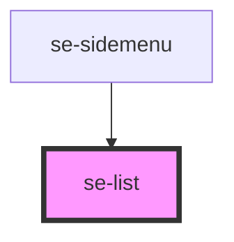

# se-list

<!-- Auto Generated Below -->

## Properties

| Property        | Attribute        | Description                                                              | Type                                                           | Default      |
| --------------- | ---------------- | ------------------------------------------------------------------------ | -------------------------------------------------------------- | ------------ |
| `canCollapse`   | `can-collapse`   | Defines if list groups can be collapsed.  The default setting is `true`. | `boolean`                                                      | `true`       |
| `option`        | `option`         | Defines the style of the list.  The default setting is `classic`.        | `"classic" \| "dropdown" \| "headline" \| "nav" \| "treeview"` | `'classic'`  |
| `selectedColor` | `selected-color` | Defines if the list element should be selected or not.                   | `"primary" \| "standard"`                                      | `'standard'` |

## CSS Custom Properties

| Name                                 | Description                                                                                        |
| ------------------------------------ | -------------------------------------------------------------------------------------------------- |
| `--se-list-group-background`         | background color of the se-item-list.                                                              |
| `--se-list-group-font-weight`        | font-weight of the se-list-group to separate from the se-list-item                                 |
| `--se-list-group-height`             | Min height of a row. Default: `47px`; Compact mode: `32px`.                                        |
| `--se-list-group-indentation`        | level of indentation of the se-list-group calculated automatically by the se-list-group component. |
| `--se-list-item-border-bottom`       | border-bottom of the se-list-item                                                                  |
| `--se-list-item-height`              | height of the se-list-item row                                                                     |
| `--se-list-item-indentation-padding` | padding indentation of the se-list-item under a group                                              |
| `--se-list-item-selected-background` | selected-background color when the item is selected                                                |
| `--se-list-item-selected-bar`        | selected-bar color when item is selected                                                           |
| `--se-list-item-selected-color`      | selected-color color of the text when the item is selected                                         |

## Dependencies

### Used by

 - [se-sidemenu](../sidemenu)

### Graph

----------------------------------------------

*Built with [StencilJS](https://stenciljs.com/)*
