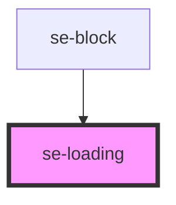

# se-loading

| Slot   | Description                                                                                       |
| ------ | ------------------------------------------------------------------------------------------------- |
| `none` | Text associated to the loading. Should be used with `option="dialog"` |

<!-- Auto Generated Below -->

## Properties

| Property   | Attribute   | Description                                                                                                                                                                                             | Type                       | Default      |
| ---------- | ----------- | ------------------------------------------------------------------------------------------------------------------------------------------------------------------------------------------------------- | -------------------------- | ------------ |
| `color`    | `color`     | Defines the color of the loading spinner.                                                                                                                                                               | `"primary" \| "secondary"` | `'primary'`  |
| `fullPage` | `full-page` | Defines if we want the loading to take the full page of the browser. default the browser will stay in the container.                                                                                    | `boolean`                  | `undefined`  |
| `loading`  | `loading`   | Displays the loading icon on screen when set to `true`.                                                                                                                                                 | `boolean`                  | `undefined`  |
| `option`   | `option`    | Defines the visual display of the loader. `standard` is the default option, and displays a spinning green circle. `dialog` gives the loading icon a look-and-feel that it is within a popup dialog box. | `"dialog" \| "standard"`   | `'standard'` |

## Dependencies

### Used by

 - [se-block](../block)

### Graph

----------------------------------------------

*Built with [StencilJS](https://stenciljs.com/)*
