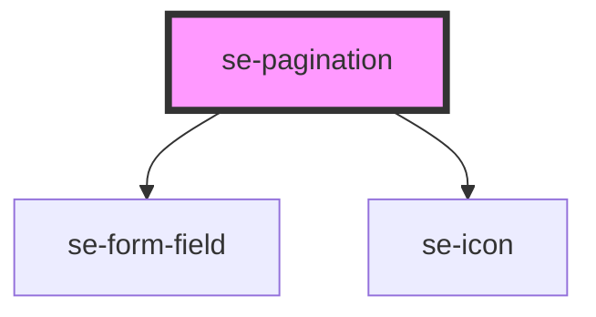

# se-pagination

<!-- Auto Generated Below -->

## Properties

| Property       | Attribute        | Description                                                                                                                                                 | Type      | Default            |
| -------------- | ---------------- | ----------------------------------------------------------------------------------------------------------------------------------------------------------- | --------- | ------------------ |
| `hideEdge`     | `hide-edge`      | Hide the "go to first page" and "go to last page" icons.                                                                                                    | `boolean` | `undefined`        |
| `labelFirst`   | `label-first`    | Label used when hover the "Go to first page" icon.                                                                                                          | `string`  | `'First Page'`     |
| `labelLast`    | `label-last`     | Label used when hover the "Go to last page" icon.                                                                                                           | `string`  | `'Last Page'`      |
| `labelNext`    | `label-next`     | Label used when hover the "Go to next page" icon.                                                                                                           | `string`  | `'Next Page'`      |
| `labelPerPage` | `label-per-page` | Text before the number of item per page selection dropdown.                                                                                                 | `string`  | `'Items per page'` |
| `labelPrev`    | `label-prev`     | Label used when hover the "Go to previous page" icon.                                                                                                       | `string`  | `'Previous Page'`  |
| `labelValue`   | `label-value`    | Text before the page selection dropdown.                                                                                                                    | `string`  | `'Page'`           |
| `perPage`      | `per-page`       | Number of item per page                                                                                                                                     | `number`  | `15`               |
| `perPageList`  | `per-page-list`  | List of per page options to select from as a string separated by `;`. Default is `"15"` but does not affect the component if not used. ex: `"15;20;25;30"`. | `string`  | `'15'`             |
| `total`        | `total`          | Total number of pages. Used to go to the last page and in the page selection dropdown.                                                                      | `number`  | `1`                |
| `value`        | `value`          | Selected page                                                                                                                                               | `number`  | `1`                |

## Events

| Event       | Description                                                                                                              | Type                     |
| ----------- | ------------------------------------------------------------------------------------------------------------------------ | ------------------------ |
| `didChange` | Event emitted when the selected page or the number of item per page changed. Return `{value: number; perPage: number;}`. | `CustomEvent<PageEvent>` |

## Dependencies

### Depends on

- [se-form-field](../form-field)
- [se-icon](../icon)

### Graph

----------------------------------------------

*Built with [StencilJS](https://stenciljs.com/)*
