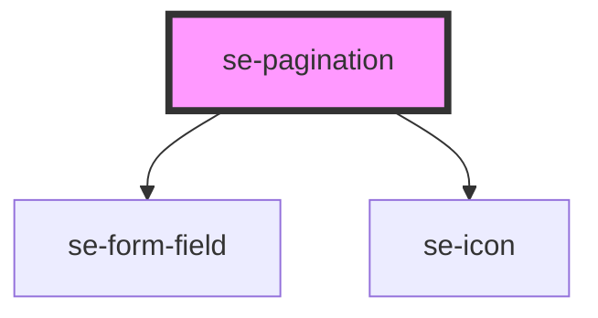

# se-pagination

<!-- Auto Generated Below -->

## Properties

| Property         | Attribute          | Description | Type      | Default           |
| ---------------- | ------------------ | ----------- | --------- | ----------------- |
| `hideEdge`       | `hide-edge`        |             | `boolean` | `undefined`       |
| `labelFirstPage` | `label-first-page` |             | `string`  | `'First Page'`    |
| `labelLastPage`  | `label-last-page`  |             | `string`  | `'Last Page'`     |
| `labelNextPage`  | `label-next-page`  |             | `string`  | `'Next Page'`     |
| `labelPage`      | `label-page`       |             | `string`  | `'Page'`          |
| `labelPageSize`  | `label-page-size`  |             | `string`  | `'Show rows:'`    |
| `labelPrevPage`  | `label-prev-page`  |             | `string`  | `'Previous Page'` |
| `nbPage`         | `nb-page`          |             | `number`  | `1`               |
| `page`           | `page`             |             | `number`  | `1`               |
| `pageSize`       | `page-size`        |             | `number`  | `15`              |
| `pageSizeList`   | `page-size-list`   |             | `string`  | `'15'`            |

## Events

| Event       | Description | Type               |
| ----------- | ----------- | ------------------ |
| `didChange` |             | `CustomEvent<any>` |

## Dependencies

### Depends on

- [se-form-field](../form-field)
- [se-icon](../icon)

### Graph

----------------------------------------------

*Built with [StencilJS](https://stenciljs.com/)*
