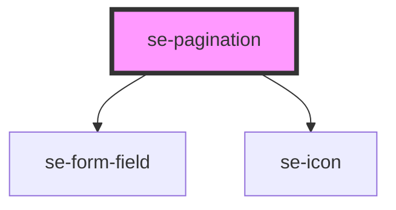

# se-pagination

<!-- Auto Generated Below -->

## Properties

| Property       | Attribute        | Description | Type      | Default            |
| -------------- | ---------------- | ----------- | --------- | ------------------ |
| `hideEdge`     | `hide-edge`      |             | `boolean` | `undefined`        |
| `labelFirst`   | `label-first`    |             | `string`  | `'First Page'`     |
| `labelLast`    | `label-last`     |             | `string`  | `'Last Page'`      |
| `labelNext`    | `label-next`     |             | `string`  | `'Next Page'`      |
| `labelPerPage` | `label-per-page` |             | `string`  | `'Items per page'` |
| `labelPrev`    | `label-prev`     |             | `string`  | `'Previous Page'`  |
| `labelValue`   | `label-value`    |             | `string`  | `'Page'`           |
| `perPage`      | `per-page`       |             | `number`  | `15`               |
| `perPageList`  | `per-page-list`  |             | `string`  | `'15'`             |
| `total`        | `total`          |             | `number`  | `1`                |
| `value`        | `value`          |             | `number`  | `1`                |

## Events

| Event       | Description | Type                     |
| ----------- | ----------- | ------------------------ |
| `didChange` |             | `CustomEvent<PageEvent>` |

## Dependencies

### Depends on

- [se-form-field](../form-field)
- [se-icon](../icon)

### Graph

----------------------------------------------

*Built with [StencilJS](https://stenciljs.com/)*
