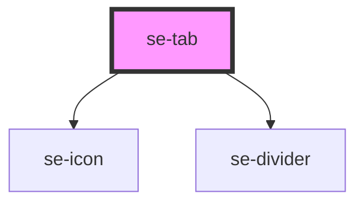

# se-tab

| Slot     | Description                                                                                   |
| -------- | --------------------------------------------------------------------------------------------- |
| `start` | Element before nav section|
| none | slot under a `nav` element |
| `end` | Element after the `nav` section |

<!-- Auto Generated Below -->

## Properties

| Property   | Attribute  | Description                                                                                                                                                                                                                                                                                              | Type                                    | Default        |
| ---------- | ---------- | -------------------------------------------------------------------------------------------------------------------------------------------------------------------------------------------------------------------------------------------------------------------------------------------------------- | --------------------------------------- | -------------- |
| `option`   | `option`   | Defines the function of the tabbar. Default `nav` creates a tab bar that functions as a nav-bar. `content` creates a ta bbar that functions as a content section tab bar.                                                                                                                                | `"anchor" \| "content" \| "navigation"` | `'navigation'` |
| `overflow` | `overflow` | Indicates the overflow behavior of your tab bar. Default setting is `scroll`, keeping all tabs in one horizontal row. The `stack` setting allows your tabbar content wrap to new lines. The `compact` setting allows your tabbar content to scroll, but all stack the text together as much as possible. | `"compact" \| "scroll" \| "stack"`      | `'scroll'`     |

## Dependencies

### Depends on

- [se-icon](../icon)
- [se-divider](../divider)

### Graph

----------------------------------------------

*Built with [StencilJS](https://stenciljs.com/)*
