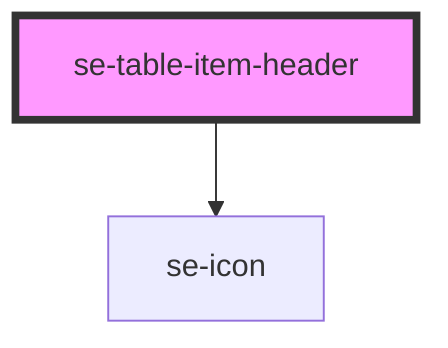

# se-list-item

<!-- Auto Generated Below -->

## Properties

| Property    | Attribute   | Description                                                                                                                                                                                                                                                                                            | Type                        | Default     |
| ----------- | ----------- | ------------------------------------------------------------------------------------------------------------------------------------------------------------------------------------------------------------------------------------------------------------------------------------------------------ | --------------------------- | ----------- |
| `clickable` | `clickable` | Optional property defines the tag type within the `se-table-item`. Default value `false` defines the tag type as `div`. `true` defines the tag type as a `button`.                                                                                                                                     | `boolean`                   | `false`     |
| `flex`      | `flex`      | Defines the specific flex-basis of a block.                                                                                                                                                                                                                                                            | `string`                    | `undefined` |
| `sort`      | `sort`      | Optional property that provides the arrow icon based on which string is provided, and also causes the `clickable` property to `true`. `asc` defines the icon as an upwards arrow in black. `desc` defines the icon as a downwards arrow in black. `none` defines the icon as an upwards arrow in grey. | `"asc" \| "desc" \| "none"` | `undefined` |

## Dependencies

### Depends on

- [se-icon](../icon)

### Graph

----------------------------------------------

*Built with [StencilJS](https://stenciljs.com/)*
