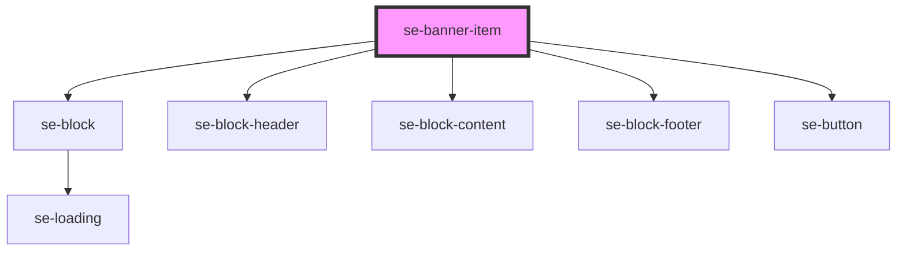

# se-banner

<!-- Auto Generated Below -->

## Properties

| Property   | Attribute   | Description                                       | Type     | Default     |
| ---------- | ----------- | ------------------------------------------------- | -------- | ----------- |
| `content`  | `content`   | Sets the body text for your banner item.          | `string` | `undefined` |
| `footer`   | `footer`    | Sets the footer text for your banner item button. | `string` | `undefined` |
| `header`   | `header`    | Sets the header text for your banner item.        | `string` | `undefined` |
| `imageUrl` | `image-url` | Sets the background image for your banner item.   | `string` | `undefined` |
| `width`    | `width`     | Sets the width of your banner item.               | `string` | `undefined` |

## Methods

### `setActive(value: boolean) => Promise<void>`

#### Returns

Type: `Promise<void>`

## Dependencies

### Depends on

- [se-block](..\block)
- [se-block-header](..\block-header)
- [se-block-content](..\block-content)
- [se-block-footer](..\block-footer)
- [se-button](..\button)

### Graph

----------------------------------------------

*Built with [StencilJS](https://stenciljs.com/)*
