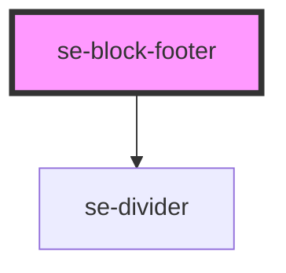

# se-block-footer

| Slot  | Description                                                             |
| ----- | ----------------------------------------------------------------------- |
| none  | Slot with no name will be positioned to the end of the element (right)  |
| `start` | Positions to the `left` of the content.                               |

<!-- Auto Generated Below -->

## Properties

| Property    | Attribute   | Description                                                                                                                                                                                                | Type                            | Default     |
| ----------- | ----------- | ---------------------------------------------------------------------------------------------------------------------------------------------------------------------------------------------------------- | ------------------------------- | ----------- |
| `direction` | `direction` | Defines the direction of the flex element. Default setting is `row`. This is perfect to use with flex content. `column` is useful in specific cases. Make sure you know what you are doing.                | `"column" \| "row"`             | `"row"`     |
| `divider`   | `divider`   | Defines whether or not a divider will be applied to the se-block-footer. The se-block component's divider property will be applied to the se-block-footer component.                                       | `boolean`                       | `undefined` |
| `option`    | `option`    | Defines the visual appearance of a footer. Updated automatically by the `se-block` component when the option is set to `card`, which will update the design of the footer with respect to the card design. | `"basic" \| "card" \| "widget"` | `undefined` |

## Dependencies

### Depends on

- [se-divider](../divider)

### Graph

----------------------------------------------

*Built with [StencilJS](https://stenciljs.com/)*
