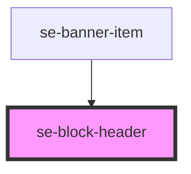

# se-block-header

| Slot  | Description                                                             |
| ----- | ----------------------------------------------------------------------- |
| `start` | Positions to the `left` of the content.                               |
| none  | Slot with no name will be positioned to the start of the element (left) |
| `end` | Positions to the `right` of the content.                                |

<!-- Auto Generated Below -->

## Properties

| Property | Attribute | Description                                                                                                                                                                                                | Type                            | Default     |
| -------- | --------- | ---------------------------------------------------------------------------------------------------------------------------------------------------------------------------------------------------------- | ------------------------------- | ----------- |
| `option` | `option`  | Defines the visual appearance of a header. Updated automatically by the `se-block` component when the option is set to `card`, which will update the design of the header with respect to the card design. | `"basic" \| "card" \| "widget"` | `undefined` |

## Dependencies

### Used by

 - [se-banner-item](..\banner-item)

### Graph

----------------------------------------------

*Built with [StencilJS](https://stenciljs.com/)*
