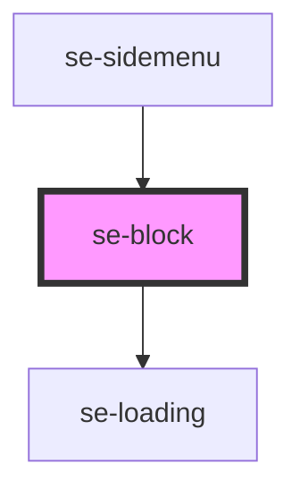

# se-block

<!-- Auto Generated Below -->

## Properties

| Property   | Attribute  | Description                                                                                                                                                                                                                           | Type                                           | Default         |
| ---------- | ---------- | ------------------------------------------------------------------------------------------------------------------------------------------------------------------------------------------------------------------------------------- | ---------------------------------------------- | --------------- |
| `color`    | `color`    | Optional property that defines the background color of the block. Default setting is `alternative` (white).                                                                                                                           | `"alternative" \| "standard" \| "transparent"` | `"alternative"` |
| `display`  | `display`  | Defines how to display the element. `flex` is the default display. `block` helps in specific cases. Make sure you know what you are doing.                                                                                            | `"block" \| "flex" \| "grid"`                  | `"flex"`        |
| `enlarged` | `enlarged` | When the display is set to `grid`, this property determines if the block should have double the width and height of a standard grid item. Default setting is `false` (1/1).                                                           | `boolean`                                      | `false`         |
| `height`   | `height`   | Defines the specific height of a block.  Useful to create easy layouts under `se-container` which uses `flex` by default.                                                                                                             | `string`                                       | `undefined`     |
| `loading`  | `loading`  | Displays the loading icon if set to `true`.  Default setting is `false`.                                                                                                                                                              | `boolean`                                      | `false`         |
| `option`   | `option`   | Defines the visual appearance of a block. `basic` will remove any spacing. `widget` will create a flat widget look and feel with a small margin around it. `card` will create a card look and feel with a shadow and rounded corners. | `"basic" \| "card" \| "widget"`                | `"basic"`       |
| `width`    | `width`    | Defines the specific width of a block.  Useful to create easy layouts under `se-container` which uses `flex` by default.                                                                                                              | `string`                                       | `undefined`     |

## Dependencies

### Used by

 - [se-sidemenu](..\sidemenu)

### Depends on

- [se-loading](..\loading)

### Graph

----------------------------------------------

*Built with [StencilJS](https://stenciljs.com/)*
