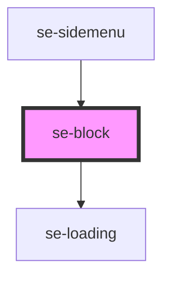

# se-block

<!-- Auto Generated Below -->

## Properties

| Property       | Attribute       | Description                                                                                                                                                                                                                                                                                                                                                                        | Type                                                   | Default         |
| -------------- | --------------- | ---------------------------------------------------------------------------------------------------------------------------------------------------------------------------------------------------------------------------------------------------------------------------------------------------------------------------------------------------------------------------------- | ------------------------------------------------------ | --------------- |
| `clickable`    | `clickable`     | Defines se-block item's ability to appear clickable / selectable. Default is `false`, no hover effects on the block level. `true` adds a hover effect on the se-block. The cursor will change to `pointer`, a box-shadow will appear, and a `$se-life-green` bar will appear at the top of the block.                                                                              | `boolean`                                              | `undefined`     |
| `clickableBar` | `clickable-bar` | Defines clickable se-block item's bar on hover. Default is `true`, `$se-life-green` bar appears on hover. `false` removes the bar from the hover effect.                                                                                                                                                                                                                           | `boolean`                                              | `undefined`     |
| `color`        | `color`         | Optional property that defines the background color of the block. `none` has no background. `standard` is `$se-background`. Default `alternative` is `$se-alternative`.                                                                                                                                                                                                            | `"alternative" \| "none" \| "standard"`                | `"alternative"` |
| `corner`       | `corner`        | Defines se-block item's corner radius. `none` is for a sharp, 90 degree corner. `nano` is for a slightly rounded, 2px rounded corner. `small` is for a rounded, 4px rounded corner.                                                                                                                                                                                                | `"nano" \| "none" \| "small"`                          | `undefined`     |
| `display`      | `display`       | Defines how to display the element. `flex` is the default display. `block` helps in specific cases. Make sure you know what you are doing.                                                                                                                                                                                                                                         | `"block" \| "flex" \| "grid"`                          | `"flex"`        |
| `divider`      | `divider`       | Defines se-block items' dividers. `true` will add a divider to the se-block-header and se-block-footer, if they are present. `false` will remove dividers on the se-block header and se-block-footer, if they are present.                                                                                                                                                         | `boolean`                                              | `undefined`     |
| `enlarged`     | `enlarged`      | When the display is set to `grid`, this property determines if the block should have double the width and height of a standard grid item. Default setting is `false` (1/1). `true` spans 2 rows and 2 columns (2/2). `vertical` spans 2 rows (2/1). `horizontal` spans 2 columns (1/2).                                                                                            | `"horizontal" \| "vertical" \| boolean`                | `false`         |
| `height`       | `height`        | Defines the specific height of a block.  Useful to create easy layouts under `se-container` which uses `flex` by default.                                                                                                                                                                                                                                                          | `string`                                               | `undefined`     |
| `loading`      | `loading`       | Displays the loading icon if set to `true`.  Default setting is `false`.                                                                                                                                                                                                                                                                                                           | `boolean`                                              | `false`         |
| `margin`       | `margin`        | Defines the spacing around the outside edge of a block. Default `none` is 0px. `small` is 4px. `medium` is 8px. `large` is 16px. `xlarge` is 32px.                                                                                                                                                                                                                                 | `"large" \| "medium" \| "none" \| "small" \| "xlarge"` | `undefined`     |
| `option`       | `option`        | Defines the visual appearance of a block. Default `basic` will remove any spacing. `widget` will create a flat widget look and feel with a `medium` margin around it. `card` will create a card look and feel with rounded corners, and with a `large` margin around it. Pending deprecation - `card-old` follows a prior design pattern with a box-shadow and will be deprecated. | `"basic" \| "card" \| "card-old" \| "widget"`          | `"basic"`       |
| `outline`      | `outline`       | Defines se-block item's outline. `true` will add a 1px border. Default is `false`.                                                                                                                                                                                                                                                                                                 | `boolean`                                              | `undefined`     |
| `outlineColor` | `outline-color` | Defines se-block item's outline color. Default is `standard` which is `$se-super-light-grey`. `primary` defines the outline color as `$se-life-green`, for Technical applications when the block is selected. `secondary` defines the outline color as `se-sky-blue`.                                                                                                              | `"primary" \| "secondary" \| "standard"`               | `undefined`     |
| `width`        | `width`         | Defines the specific width of a block.  Useful to create easy layouts under `se-container` which uses `flex` by default.                                                                                                                                                                                                                                                           | `string`                                               | `undefined`     |

## Dependencies

### Used by

 - [se-sidemenu](../sidemenu)

### Depends on

- [se-loading](../loading)

### Graph

----------------------------------------------

*Built with [StencilJS](https://stenciljs.com/)*
