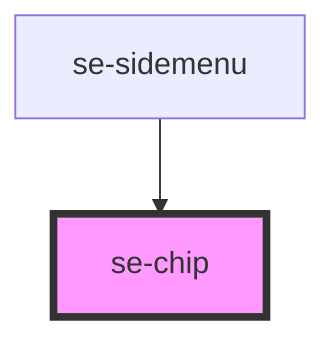

# se-chip

<!-- Auto Generated Below -->

## Properties

| Property   | Attribute   | Description                                                                                                | Type                                                                                                                                                       | Default      |
| ---------- | ----------- | ---------------------------------------------------------------------------------------------------------- | ---------------------------------------------------------------------------------------------------------------------------------------------------------- | ------------ |
| `canClose` | `can-close` | Indicates whether or not the chip has a close button.  Set to `true` by default.                           | `boolean`                                                                                                                                                  | `true`       |
| `color`    | `color`     | Defines the background color of the chip.  The default setting is `standard`, which is a light gray color. | `"alternative" \| "darkBlue" \| "fuchsia" \| "gray" \| "orange" \| "primary" \| "red" \| "secondary" \| "selected" \| "skyBlue" \| "standard" \| "yellow"` | `'standard'` |
| `disabled` | `disabled`  | Indicates whether or not the chip is disabled.  Set to `false` by default.                                 | `boolean`                                                                                                                                                  | `false`      |
| `value`    | `value`     | The text you want to display in your chip.                                                                 | `string`                                                                                                                                                   | `undefined`  |

## Events

| Event      | Description                                                                           | Type               |
| ---------- | ------------------------------------------------------------------------------------- | ------------------ |
| `didClose` | Send the chip value to the parent component when clicking the close button of a chip. | `CustomEvent<any>` |

## Dependencies

### Used by

 - [se-sidemenu](..\sidemenu)

### Graph

----------------------------------------------

*Built with [StencilJS](https://stenciljs.com/)*
