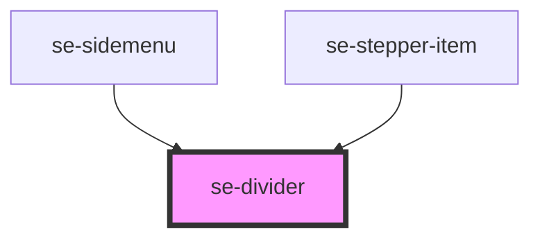

# se-divider

<!-- Auto Generated Below -->

## Properties

| Property | Attribute | Description                                                                                                                                                                        | Type                                    | Default        |
| -------- | --------- | ---------------------------------------------------------------------------------------------------------------------------------------------------------------------------------- | --------------------------------------- | -------------- |
| `color`  | `color`   | Indicates the color schema of your divider line. Default setting is `standard`, rendering a light gray colored line. The `alternative` property sets a white colored divider line. | `"alternative" \| "standard"`           | `"standard"`   |
| `option` | `option`  | Indicates the visual appearance of your divider line.  Default setting is `horizontal`.                                                                                            | `"horizontal" \| "inset" \| "vertical"` | `"horizontal"` |

## Dependencies

### Used by

 - [se-sidemenu](../sidemenu)
 - [se-stepper-item](../stepper-item)

### Graph

----------------------------------------------

*Built with [StencilJS](https://stenciljs.com/)*
