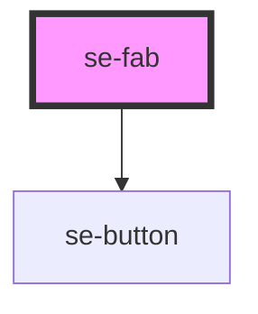

# se-fab

<!-- Auto Generated Below -->

## Properties

| Property   | Attribute  | Description                                                                                                                                                                         | Type                         | Default       |
| ---------- | ---------- | ----------------------------------------------------------------------------------------------------------------------------------------------------------------------------------- | ---------------------------- | ------------- |
| `color`    | `color`    | Indicates the color of your main action button . Default setting is `primary`, rendering a green background. The `alternative` setting renders a white background.                  | `"alternative" \| "primary"` | `'primary'`   |
| `icon`     | `icon`     | Property that determines  icon included in the main action button.                                                                                                                  | `string`                     | `undefined`   |
| `option`   | `option`   | Property that determines  icon included in the main action button.                                                                                                                  | `"backtotop" \| "speeddial"` | `'speeddial'` |
| `position` | `position` | Property that determines position of main action button.   Default setting is `bottom`, rendering a FAB at bottom right corner. The `top` setting renders  FAB at top right corner. | `"bottom" \| "top"`          | `'bottom'`    |

## Methods

### `getIcon() => Promise<any>`

#### Returns

Type: `Promise<any>`

### `toggleAction() => Promise<void>`

Method to toggle(show/hide) the mini action buttons.

#### Returns

Type: `Promise<void>`

## Dependencies

### Depends on

- [se-button](..\button)

### Graph

----------------------------------------------

*Built with [StencilJS](https://stenciljs.com/)*
