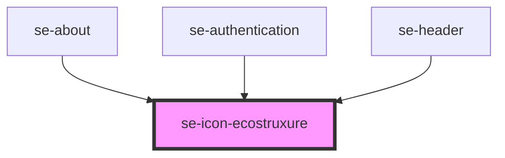

# se-icon-ecostruxure

<!-- Auto Generated Below -->

## Properties

| Property | Attribute | Description                                                             | Type                  | Default   |
| -------- | --------- | ----------------------------------------------------------------------- | --------------------- | --------- |
| `size`   | `size`    | Sets the size of the EcoStruxure icon.  The default setting is `small`. | `"medium" \| "small"` | `"small"` |

## Dependencies

### Used by

 - [se-about](..\about)
 - [se-authentication](..\authentication)
 - [se-header](..\header)

### Graph

----------------------------------------------

*Built with [StencilJS](https://stenciljs.com/)*
