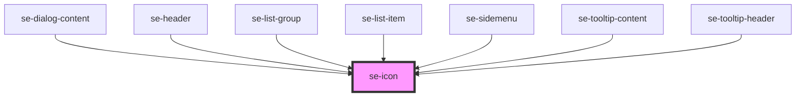

# se-icon

<!-- Auto Generated Below -->

## Properties

| Property | Attribute | Description                                                                                                             | Type                                                                                           | Default     |
| -------- | --------- | ----------------------------------------------------------------------------------------------------------------------- | ---------------------------------------------------------------------------------------------- | ----------- |
| `color`  | `color`   | Optional property that defines the background color of the button. The default color will be inherited from its parent. | `"alternative" \| "error" \| "primary" \| "secondary" \| "standard" \| "success" \| "warning"` | `undefined` |
| `option` | `option`  | Optional property to define if the icon should act as a button (clickable).                                             | `"button"`                                                                                     | `undefined` |
| `size`   | `size`    | Defines the size of an icon. The default size is `small` (24px). `medium` is 36px, and `large` is 63px.                 | `"large" \| "medium" \| "nano" \| "small" \| "xlarge"`                                         | `"small"`   |

## Dependencies

### Used by

 - [se-dialog-content](../dialog-content)
 - [se-header](../header)
 - [se-list-group](../list-group)
 - [se-list-item](../list-item)
 - [se-sidemenu](../sidemenu)
 - [se-tooltip-content](../tooltip-content)
 - [se-tooltip-header](../tooltip-header)

### Graph

----------------------------------------------

*Built with [StencilJS](https://stenciljs.com/)*
