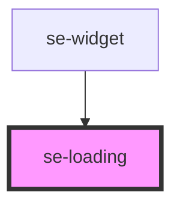

# se-loading

<!-- Auto Generated Below -->

## Properties

| Property  | Attribute | Description                                             | Type      | Default     |
| --------- | --------- | ------------------------------------------------------- | --------- | ----------- |
| `loading` | `loading` | Displays the loading icon on screen when set to `true`. | `boolean` | `undefined` |

## Dependencies

### Used by

 - [se-widget](..\widget)

### Graph

----------------------------------------------

*Built with [StencilJS](https://stenciljs.com/)*
