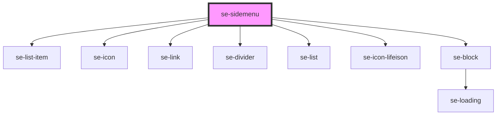

# se-sidemenu

<!-- Auto Generated Below -->

## Properties

| Property | Attribute | Description                         | Type     | Default  |
| -------- | --------- | ----------------------------------- | -------- | -------- |
| `label`  | `label`   | Overrides the default "Menu" label. | `string` | `'Menu'` |

## Methods

### `toggle() => Promise<void>`

#### Returns

Type: `Promise<void>`

## Dependencies

### Depends on

- [se-list-item](..\list-item)
- [se-icon](..\icon)
- [se-link](..\link)
- [se-divider](..\divider)
- [se-list](..\list)
- [se-icon-lifeison](..\icon-lifeison)
- [se-block](..\block)

### Graph

----------------------------------------------

*Built with [StencilJS](https://stenciljs.com/)*
