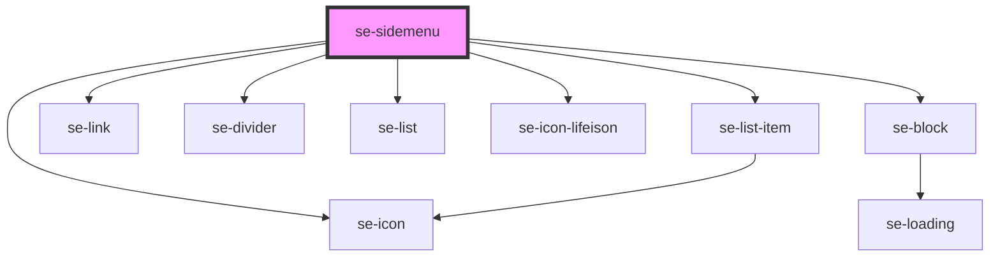

# se-sidemenu

<!-- Auto Generated Below -->

## Properties

| Property | Attribute | Description                                                                            | Type     | Default  |
| -------- | --------- | -------------------------------------------------------------------------------------- | -------- | -------- |
| `label`  | `label`   | Defines the text displayed in the header of the Sidemenu. The default value is `Menu`. | `string` | `'Menu'` |

## Methods

### `toggle() => Promise<void>`

#### Returns

Type: `Promise<void>`

## Dependencies

### Depends on

- [se-list-item](../list-item)
- [se-icon](../icon)
- [se-link](../link)
- [se-divider](../divider)
- [se-list](../list)
- [se-icon-lifeison](../icon-lifeison)
- [se-block](../block)

### Graph

----------------------------------------------

*Built with [StencilJS](https://stenciljs.com/)*
